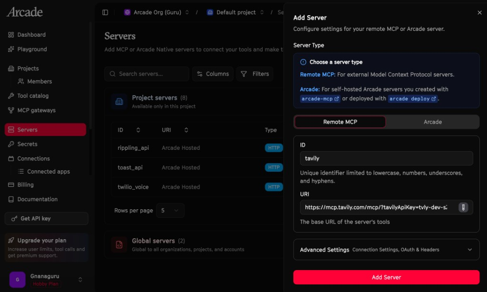
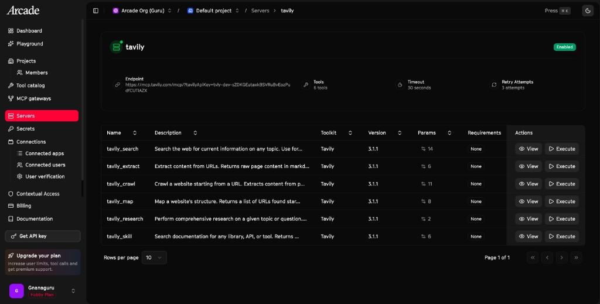
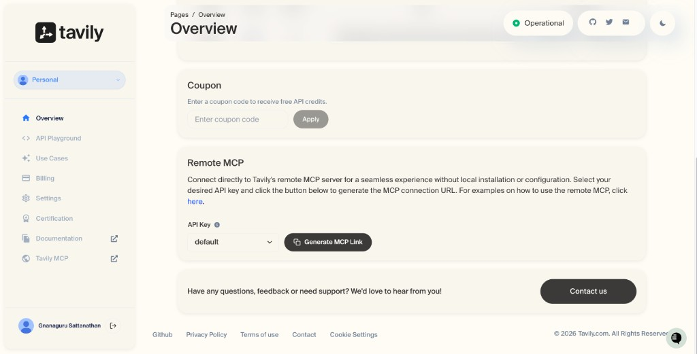
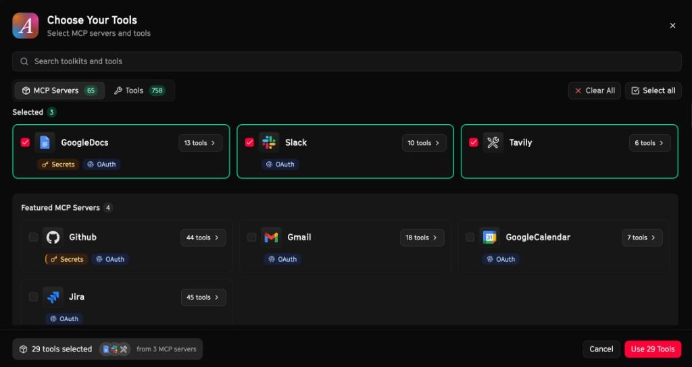

# Financial Intelligence Agent

> Powered by Tavily & Arcade

A web-based financial research assistant. Research companies, analyze markets,
create Google Docs briefings, and share to Slack — all through one chat
interface.

Built with [Tavily](https://tavily.com) for real-time research,
[Arcade](https://arcade.dev) as the MCP runtime, and
[Vercel AI SDK](https://sdk.vercel.ai) for streaming chat with MCP tool
support.

---

## How It Works

```
┌──────────────────────────────────────────────────────────────┐
│                   Arcade MCP Runtime                         │
│                                                              │
│  Tavily (6 tools)   Google Docs (13 tools)   Slack (10 tools)│
│  search, research,  create, edit, share      send, read,     │
│  extract, crawl,    search, comment          list, invite    │
│  map, skill                                                  │
└──────────────────────────────────────────────────────────────┘
                           ▲
                           │  streamable HTTP + headers auth
                           │
                   ┌───────┴────────┐
                   │  Next.js App   │
                   │  Vercel AI SDK │
                   │  + Anthropic   │
                   └────────────────┘
```

The Vercel AI SDK's `createMCPClient` connects to the Arcade MCP Gateway over
streamable HTTP. All 29 tools from 3 MCP servers (Tavily, Google Docs, Slack)
are available through a single gateway URL. Authorization, execution, and
governance are handled by Arcade.

---

## Prerequisites

- Node.js 18+
- A [Tavily](https://tavily.com) account (for the remote MCP URL)
- An [Arcade](https://arcade.dev) account (free tier)
- An [Anthropic](https://console.anthropic.com) API key

---

## Setup

### Step 1: Get your Tavily MCP URL

Go to [tavily.com](https://tavily.com) > Overview > Generate MCP Link.



### Step 2: Add Tavily as a Remote MCP Server in Arcade

Go to [Arcade Dashboard](https://api.arcade.dev/dashboard) > Servers > Add
Server > Remote MCP. Paste the Tavily MCP URL.



### Step 3: Verify Tavily tools

Arcade discovers 6 Tavily tools: `tavily_search`, `tavily_extract`,
`tavily_crawl`, `tavily_map`, `tavily_research`, `tavily_skill`.



### Step 4: Create an MCP Gateway

Go to MCP Gateways > Create Gateway. Select Tavily + GoogleDocs + Slack.
Set the auth mode to **Arcade Headers**.



Copy the gateway URL.

### Step 5: Configure and run

```bash
cp .env.example .env.local
# Edit .env.local with your keys
npm install
npm run dev
```

Open [http://localhost:3000](http://localhost:3000).

---

## Environment Variables

| Variable | Description |
|---|---|
| `ANTHROPIC_API_KEY` | Anthropic API key |
| `ARCADE_GATEWAY_URL` | Arcade MCP Gateway URL |
| `ARCADE_API_KEY` | Arcade API key (from dashboard sidebar) |
| `ARCADE_USER_ID` | Your email for Arcade user context |

---

## Project Structure

```
app/
  page.tsx                        Chat UI with useChat, streaming, notes panel
  api/chat/route.ts               Backend: MCP client + streamText
  layout.tsx                      Root layout and metadata
  globals.css                     Tailwind + finance theme styles
  components/
    tool-progress.tsx             Tool call display with service labels
    markdown-content.tsx          Rendered markdown with react-markdown
    contextual-suggestions.tsx    Smart suggestion pills above input
    notes-panel.tsx               Collapsible right sidebar for pinned notes
lib/
  prompts.ts                      Financial analyst system prompt
images/                           Setup screenshots for this guide
.env.example                      Environment template
```

---

## Example Prompts

- "What happened with NVDA in the last 24 hours?"
- "Research TSLA: earnings, analyst notes, SEC filings"
- "Compare MSFT and GOOGL on their AI investments"
- "Prepare a pre-market brief for AAPL, AMZN, META. Create a Google Doc."
- "Post a summary of today's semiconductor news to #investment-team on Slack"

---

## Built With

- [Tavily](https://tavily.com) — Real-time search, research, and extraction
- [Arcade](https://arcade.dev) — The MCP runtime: authorization, reliable tools, governance
- [Vercel AI SDK](https://sdk.vercel.ai) — Streaming AI with MCP tool support
